# AI intelligent library building assistant

The symbol encapsulation generator based on large models provides intelligent component library construction solutions for Jialichuang EDA Professional Edition.

## Functional features

- **AI-Powered**: Intelligently recognizes and generates component symbols based on large language models
- **PDF Parsing**: Supports extracting component information from PDF datasheets
- **Precise Identification**: Automatically identify pin information, package parameters, and component specifications
- **Multi-Package Support**: Supports multiple package types such as BGA, DIP, QFN, and more
- **Visual Interface**: Provides an intuitive graphical operation interface
- **Live Preview**: Supports real-time preview of symbols and encapsulations
- **Information Copy**: Supports quick copying and editing of symbolic information

## Key Features

### Symbol generation

- **Smart Recognition**: Automatically extract foot information from PDF documents
- **Symbol Creation**: Generates standardized symbols based on the extracted information
- **Pin Configuration**: Supports editing and optimization of pin information
- **Layout Optimization**: Automatically layout symbols arranged on both sides

### Encapsulation generation

- **Parameter Extraction**: Extract package size parameters from technical documentation
- **Auto-generation**: Automatically generate the corresponding package according to the parameters
- **Preview Feature**: Provides a real-time preview of the package
- **Parameter Adjustment**: Supports manual fine-tuning of package parameters

## Supported package types

| Package Type | Support Status    | Description                                                     |
| ------------ | ----------------- | --------------------------------------------------------------- |
| **BGA**      | ✅ Support        | Ball grid array package, middle rectangle needs API improvement |
| **DIP**      | ✅ Support        | Dual in-line package, pads to be improved by API                |
| **QFN**      | ✅ Full Support   | Quad Flat Leadless Package                                      |
| **QFP**      | 🔄 In development | Quad Flat Package                                               |
| **SOP**      | 🔄 Planned        | Small form factor package                                       |

## Instructions for Use

### Configure extensions

1. Import the eext extension file of this extension in 'Settings' -' Extensions' - 'Extension Manager',** Enable and allow external interaction of the extension **.  
   

2. The expansion entry is located in the 'Symbol' and 'Encapsulation' editing interfaces. Enter any interface, select the "Smart Library Building" column in the top navigation bar, and then choose "Create xx" from the drop-down list.  
   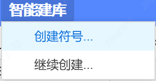

3. In the top list of the assistant window, select 'Settings', configure' Model Vendor ', 'Select Model', and 'API Key'  
   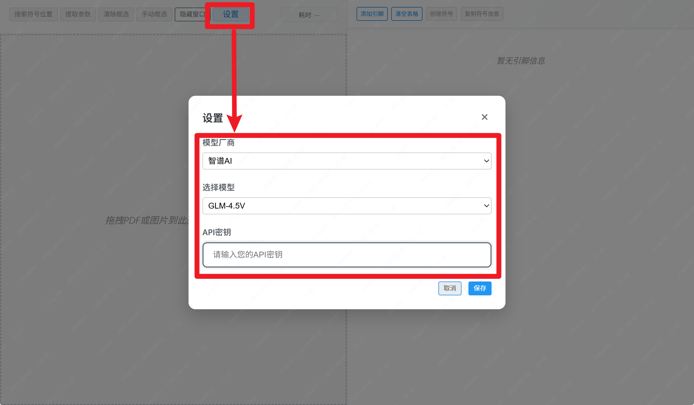

    **Obtain API Key**:  
    Through righteousness qian q: [ali YunBaiLian - get APIKey] (https://bailian.console.aliyun.com/?tab=api#/api)  
    Spectrum AI zhi: [BigModel - get APIKey] (https://docs.bigmodel.cn/cn/guide/develop/http/introduction#%E8%8E%B7%E5%8F%96-api-key)

### Symbol creation

1. In the EDA editor, select 'File' - 'New' - 'Symbol'
   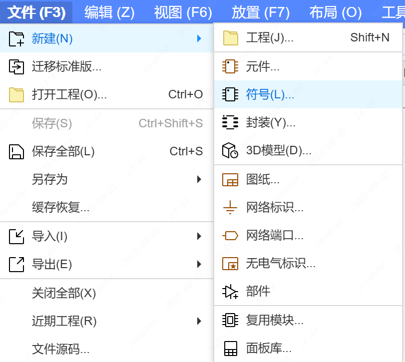

2. In the top navigation bar of the symbol editing interface, select "Smart Library Building" - "Create Symbol"  
   

3. Upload the PDF or image of the symbol you need to extract on the left side of the "Symbol Extraction Assistant"  
   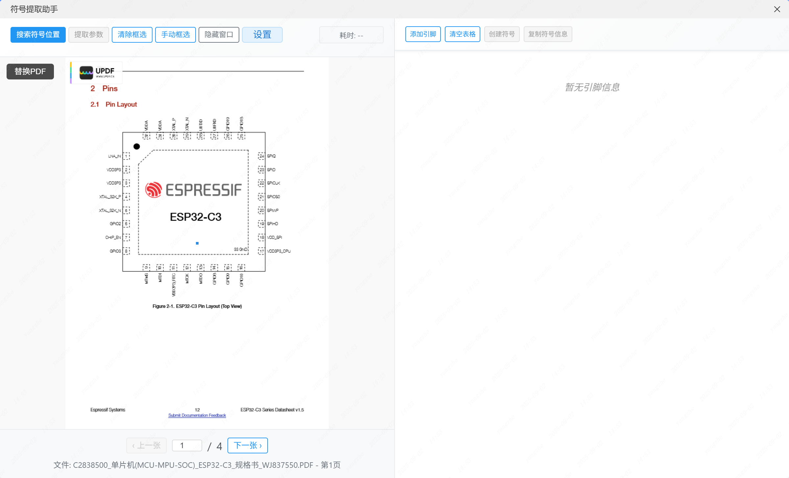

4. In the top navigation bar of the "Symbol Extraction Assistant", select "Search Symbol Position" to automatically search for the symbol position or "Manually Select" to manually specify the symbol position. After selection, click "Extract Parameters" to extract the pin parameters.  
   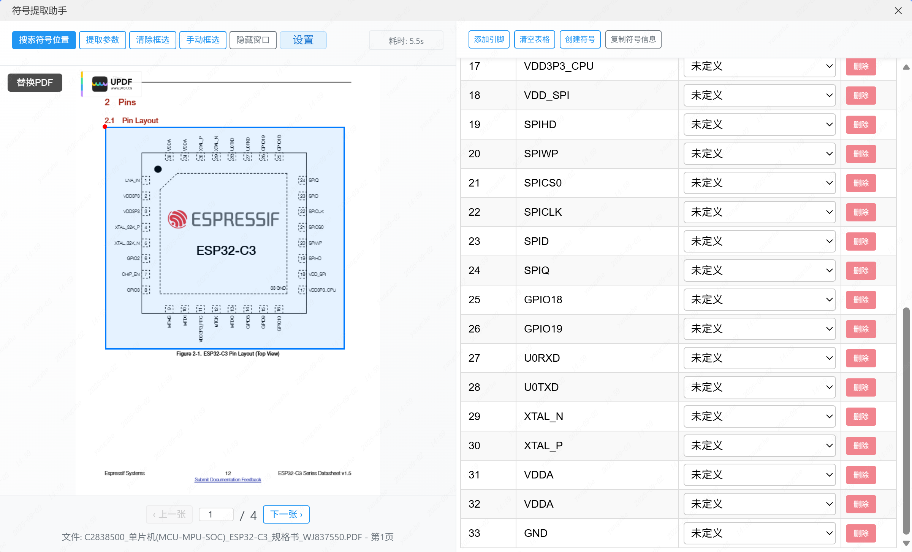

5. Select "Create Symbol" in the top navigation bar on the right to generate a symbol.  
   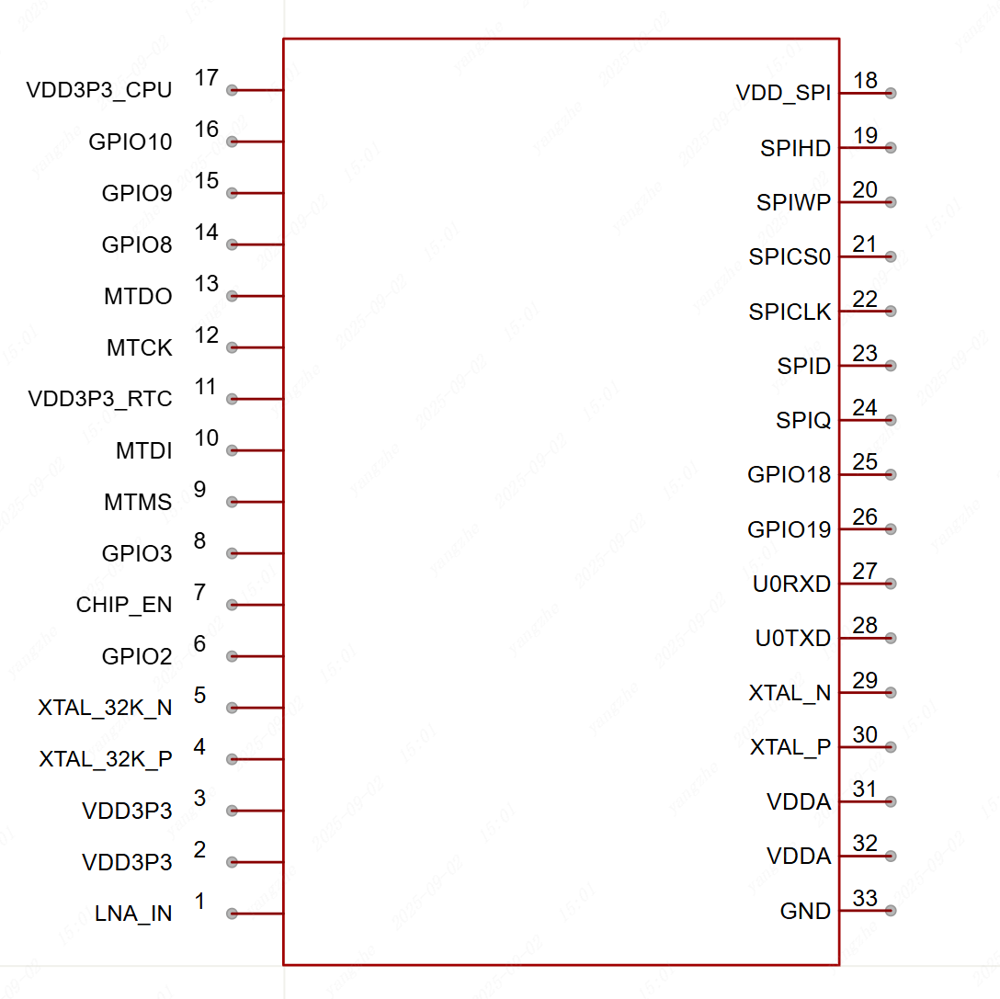

### Encapsulation creation

1. In the EDA editor, select 'File' - 'New' - 'Package'  
   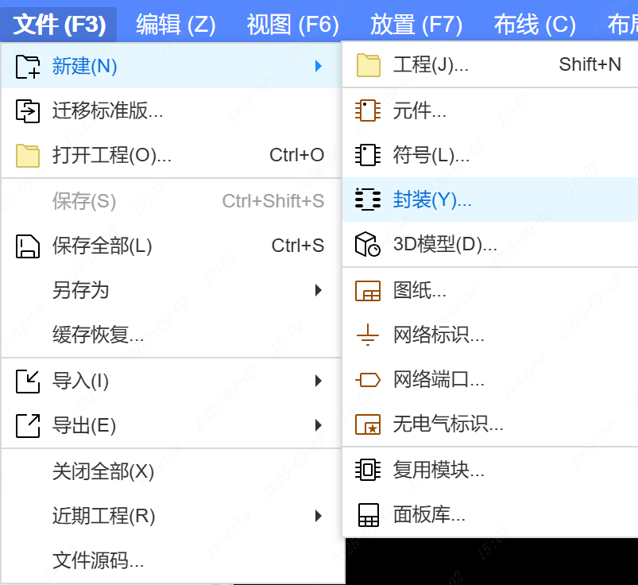

2. In the top navigation bar of the symbol editing interface, select "Smart Library Building" - "Create Encapsulation"  
   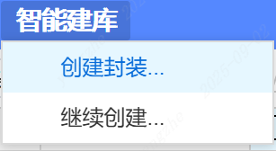

3. Upload the PDF or image of the symbol you need to extract on the left side of the "Encapsulation Generator"  
   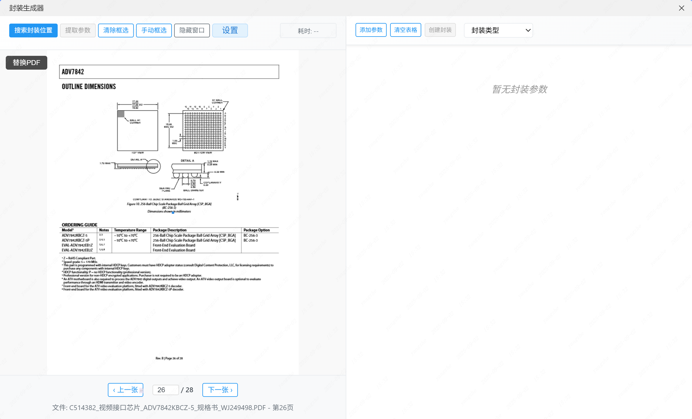

4. In the top navigation bar of "Package Generator", select "Search Package Location" to automatically search for the package location or "Manually Select" to manually specify the symbol location. After selection, click "Extract Parameters" to extract the pin parameters.  
   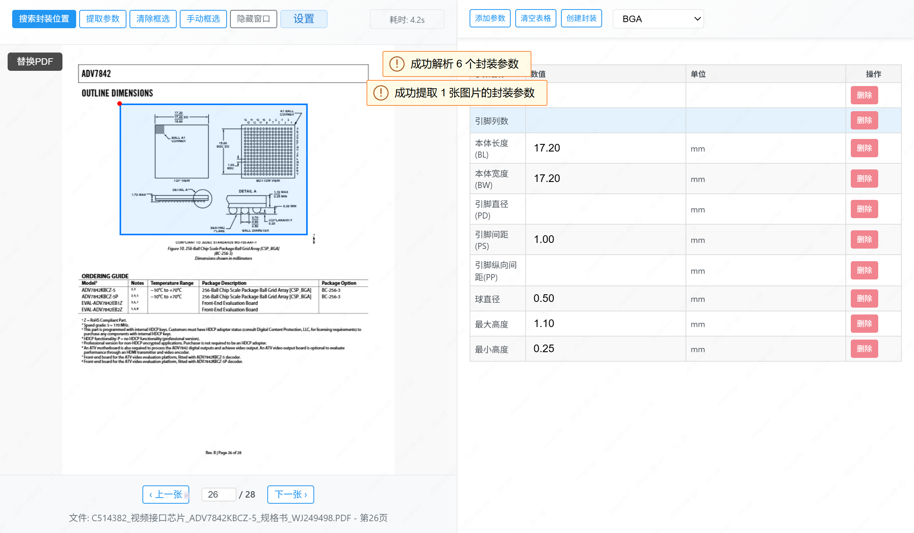

5. Select "Create Encapsulation" in the top navigation bar on the right to generate the symbol.  
   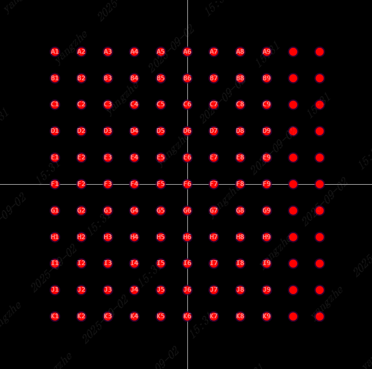

---

**AI Intelligent Library Building Assistant ** - Making component library construction smarter and more efficient!
