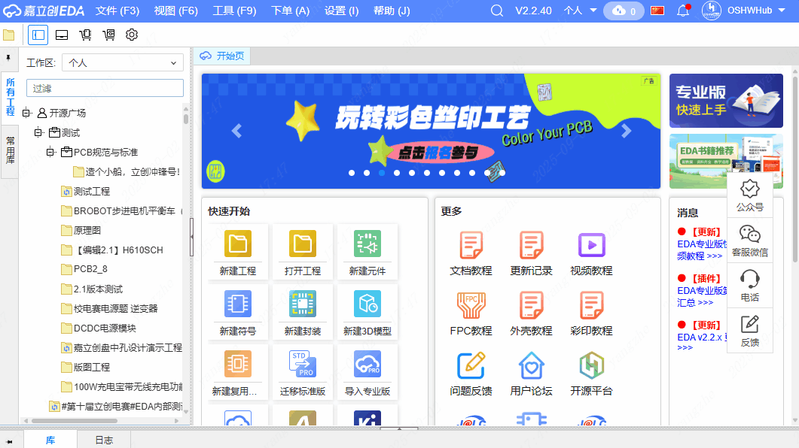
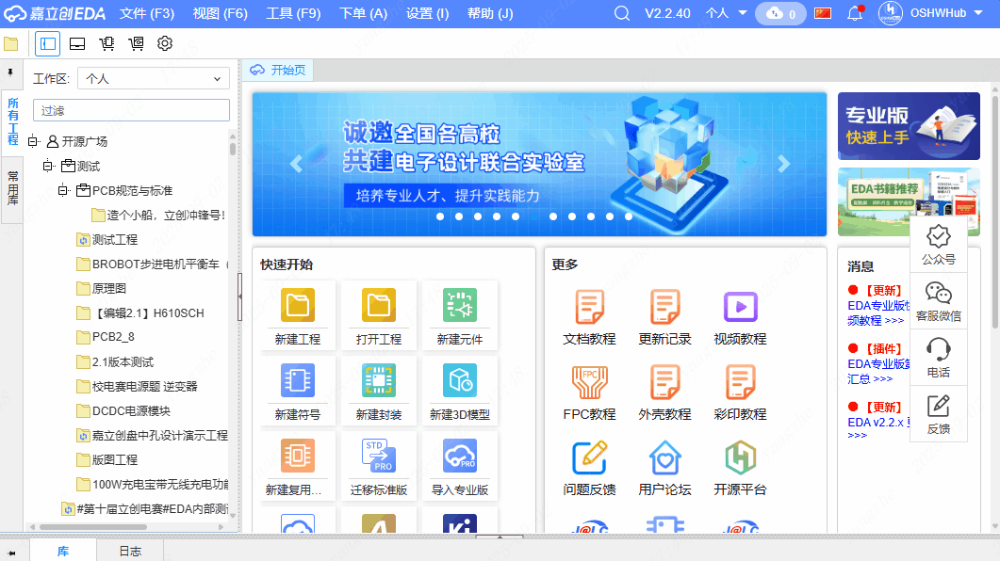
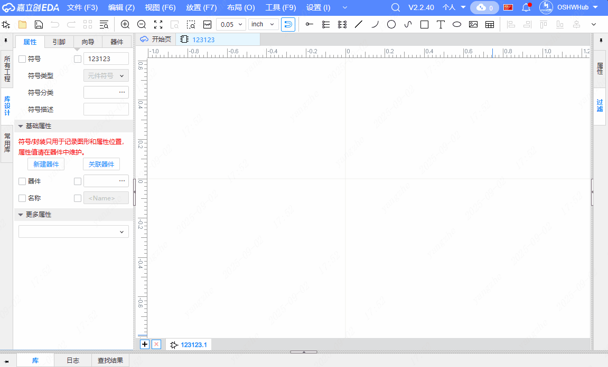
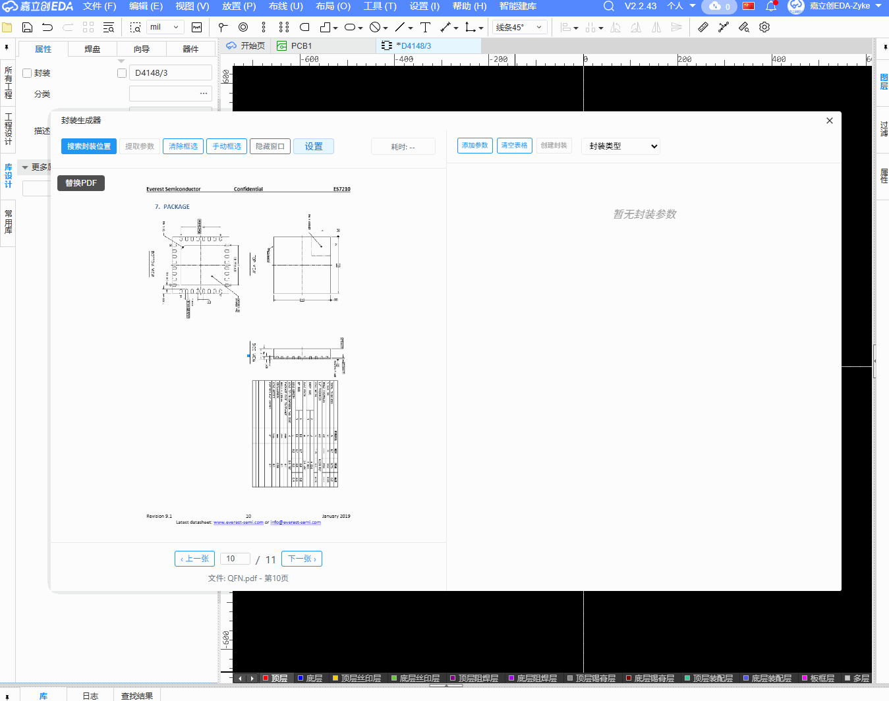

# AI Intelligent Library Building Assistant

[中文](./README.md)

The symbol and footprint generator based on large models provides intelligent component library construction solutions for EasyEDA Professional Edition.

## Functional Features

- **AI-Powered**: Intelligently recognizes and generates component symbols based on large language models
- **PDF Parsing**: Supports extracting component information from PDF datasheets
- **Precise Identification**: Automatically identify pin information, package parameters, and component specifications
- **Multi-Package Support**: Supports multiple package types such as BGA, DIP, QFN, and more
- **Visual Interface**: Provides an intuitive graphical operation interface
- **Live Preview**: Supports real-time preview of symbols and footprints
- **Information Copy**: Supports quick copying and editing of symbol information

## Key Features

### Symbol Generation

- **Smart Recognition**: Automatically extract pin information from PDF documents
- **Symbol Creation**: Generate standardized symbols based on extracted information
- **Pin Configuration**: Support editing and optimization of pin information
- **Layout Optimization**: Automatically perform dual-side symbol layout

### Footprint Generation

- **Parameter Extraction**: Extract footprint dimension parameters from technical documents
- **Auto-Generation**: Automatically generate corresponding footprints based on parameters
- **Preview Feature**: Provide real-time preview of footprints
- **Parameter Adjustment**: Support manual fine-tuning of footprint parameters

## Supported Footprint Types

| Footprint Type | Support Status | Description                                                  |
| -------------- | -------------- | ------------------------------------------------------------ |
| **BGA**        | ✅ Support     | Ball grid array package, middle rectangle needs API improvement |
| **DIP**        | ✅ Support     | Dual in-line package, pads need API improvement              |
| **QFN**        | ✅ Support     | Quad flat no-lead package                                    |
| **QFP**        | ✅ Support     | Quad flat package                                            |
| **SOP**        | ✅ Support     | Small outline package                                        |

## Instructions for Use

### Configure Extension

1. Import the eext extension file of this extension in `Settings` - `Extensions` - `Extension Manager`, **enable and allow external interaction of the extension**.

  
2. The extension entry is located in the `Symbol` and `Footprint` editing interfaces. Enter any interface, select the `Smart Library Building` bar in the top navigation bar and select `Create xx` from the drop-down list.  
3. In the top list of the assistant window, select `Settings`, configure `Model Vendor`, `Select Model`, and `API Key`.  
**Get API Key**:  
 Qwen: [Alibaba Cloud Bailian - Get APIKey](https://bailian.console.aliyun.com/?tab=api#/api)  
 Zhipu AI: [BigModel - Get APIKey](https://docs.bigmodel.cn/cn/guide/develop/http/introduction#%E8%8E%B7%E5%8F%96-api-key)

### Symbol Creation

1. In the EDA editor, select `File` - `New` - `Symbol`.
2. In the top navigation bar of the symbol editing interface, select `Smart Library Building` - `Create Symbol`.
3. In the `Symbol Extraction Assistant`, upload the PDF or image from which you need to extract the symbol on the left side.
4. In the top navigation bar of the `Symbol Extraction Assistant`, select `Search Symbol Position` to automatically search for the symbol position or `Manually Select` to manually specify the symbol position. After selection, click `Extract Parameters` to extract pin parameters.
5. Select `Create Symbol` in the top navigation bar on the right to generate the symbol.

### Footprint Creation

1. In the EDA editor, select `File` - `New` - `Footprint`.
2. In the top navigation bar of the symbol editing interface, select `Smart Library Building` - `Create Footprint`.
3. In the `Footprint Generator`, upload the PDF or image from which you need to extract the footprint on the left side.
4. **Optional**: On the right side, select the specific footprint type (BGA, DIP, QFN, QFP, SOP, etc.). After selection, a single precise extraction will be performed.
5. In the top navigation bar of the `Footprint Generator`, select `Search Footprint Position` to automatically search for the footprint position or `Manually Select` to manually specify the position. After selection, click `Extract Parameters`:
    - **Footprint type selected**: The extension performs a single precise extraction, extracting corresponding parameters for the specific footprint type
    - **Footprint type not selected**: The extension automatically performs two extractions and intelligently selects the best result
6. Select `Create Footprint` in the top navigation bar on the right to generate the footprint.
