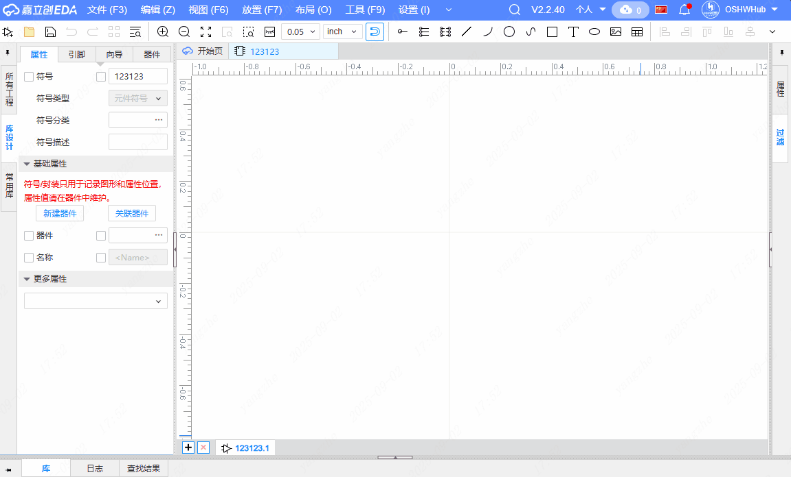
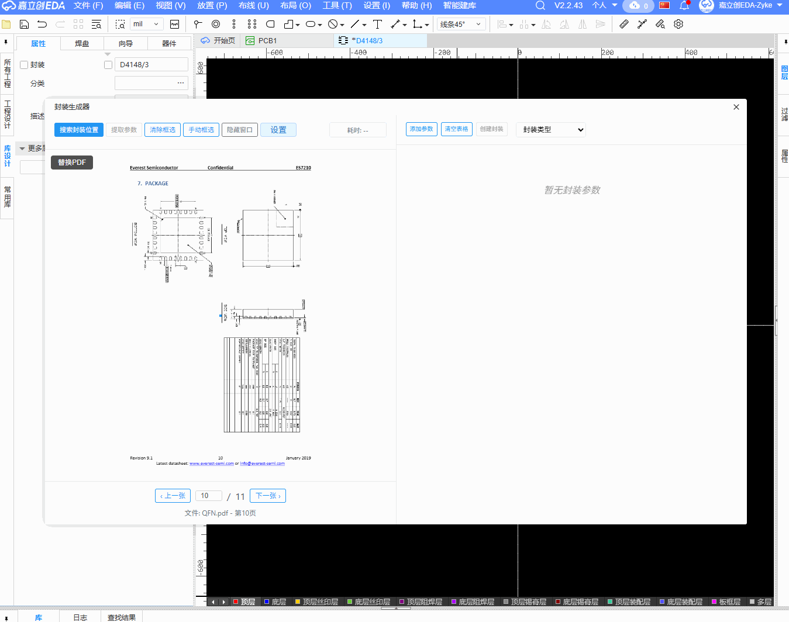

# AI 智能建库助手

基于大模型的符号封装生成器，为嘉立创EDA专业版提供智能化的元件库构建解决方案。

## 功能特性

- **AI 驱动**: 基于大语言模型智能识别和生成元件符号
- **PDF 解析**: 支持从 PDF 数据手册中提取元件信息
- **精准识别**: 自动识别引脚信息、封装参数和元件规格
- **多封装支持**: 支持 BGA、DIP、QFN 等多种封装类型
- **可视化界面**: 提供直观的图形化操作界面
- **实时预览**: 支持符号和封装的实时预览功能
- **信息复制**: 支持符号信息的快速复制和编辑

## 主要功能

### 符号生成

- **智能识别**: 从PDF文档中自动提取引脚信息
- **符号创建**: 基于提取的信息生成标准化符号
- **引脚配置**: 支持引脚信息的编辑和优化
- **布局优化**: 自动进行两边排布的符号布局

### 封装生成

- **参数提取**: 从技术文档中提取封装尺寸参数
- **自动生成**: 根据参数自动生成对应封装
- **预览功能**: 提供封装的实时预览
- **参数调整**: 支持封装参数的手动微调

## 支持的封装类型

| 封装类型 | 支持状态    | 说明                            |
| -------- | ----------- | ------------------------------- |
| **BGA**  | ✅ 支持     | 球栅阵列封装，中间矩形待API完善 |
| **DIP**  | ✅ 支持     | 双列直插封装，焊盘待API完善     |
| **QFN**  | ✅ 完整支持 | 四方扁平无引脚封装              |
| **QFP**  | 🔄 开发中   | 四方扁平封装                    |
| **SOP**  | 🔄 计划中   | 小外形封装                      |

## 使用说明

### 配置扩展

1. 在`设置`-`扩展`-`扩展管理器`中导入本扩展的eext扩展文件,**启用并允许扩展外部交互**。

  
2. 扩展入口位于`符号`及`封装`编辑界面。进入任意界面，在顶部导航栏选择`智能建库`栏并在下拉列表选择`创建xx`。  
3. 在助手窗口的顶部列表选择`设置`，配置`模型厂商`，`选择模型`，`API密钥`。  
**获取API Key**:  
 通义千问：[阿里云百炼—获取APIKey](https://bailian.console.aliyun.com/?tab=api#/api)  
 智谱AI：[BigModel—获取APIKey](https://docs.bigmodel.cn/cn/guide/develop/http/introduction#%E8%8E%B7%E5%8F%96-api-key)

### 符号创建

1. 在EDA编辑器中选择`文件`-`新建`-`符号`。
2. 在符号编辑界面的顶部导航栏选择`智能建库`-`创建符号`。
3. 在`符号提取助手`中的左侧上传需要提取符号的PDF或图片。
4. 在`符号提取助手`顶部导航栏选择`搜索符号位置`自动搜索符号位置或`手动框选`手动指定符号位置，选择后点击`提取参数`即可提取引脚参数。
5. 在右侧顶部导航栏选择`创建符号`即可生成符号。

### 封装创建

1. 在EDA编辑器中选择`文件`-`新建`-`封装`。
2. 在符号编辑界面的顶部导航栏选择`智能建库`-`创建封装`。
3. 在`封装生成器`中的左侧上传需要提取符号的PDF或图片。
4. 在`封装生成器`顶部导航栏选择`搜索封装位置`自动搜索封装位置或`手动框选`手动指定符号位置，选择后点击`提取参数`即可提取引脚参数。
5. 在右侧顶部导航栏选择`创建封装`即可生成符号。

---

**AI 智能建库助手** - 让元件库构建更智能、更高效！
